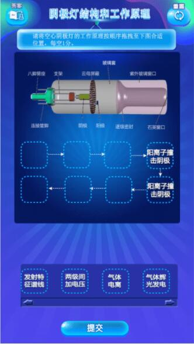
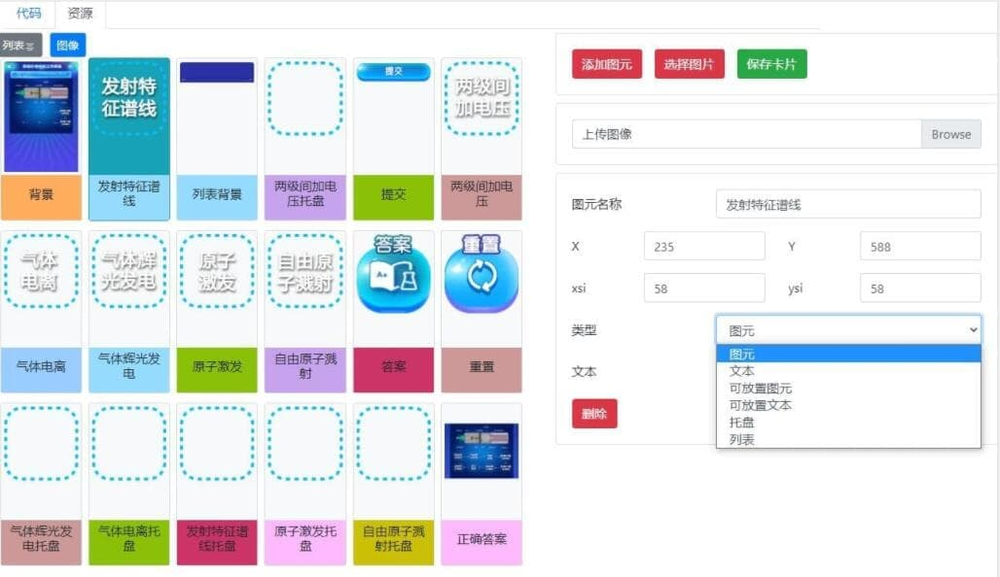
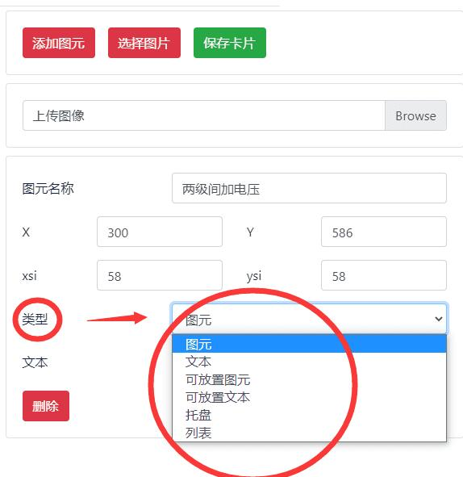

---

id: Concept
title: 基本概念
---

本章节，主要以示例项目，介绍开发平台基础概念及定义。

## 示例项目

### 阴极灯结构和工作原理

- 移动设备，请扫描以下二维码：

  

- PC设备直接访问以下链接：

  - 体验地址：https://dffz-h5.webtrn.cn/TES_tool/index.html?id=tesdist/esst001/d0cc4aaa_bf2f_41d4_bbdd_8513c0e52fac

  - 效果如下：

    

## 资源定义

如下图所示：

### 图元的类型：

图元是具有多种**`“类型”`**的，每种类型所配备的效果都是不同的，要根据需求去搭配类型，从而实现统一。

- 这里可以看到图元的所有类型，分别为：列表，图元，文本，可放置图元，可放置文本，托盘。

### 用法

| 类型       | 用途                                                         | 切图要求                        | 备注                                                         |
| ---------- | ------------------------------------------------------------ | ------------------------------- | ------------------------------------------------------------ |
| 背景       | 只能用于，展示任务卡背景，包含 **标题** 、以及**设备或流程**背景； | **.jpg格式**，**不超过100KB**； | 不能附带：答案、重置、图元、托盘、列表等素材                 |
| 图元       | 只能用于，**可点击的、不可固定在选择栏的图元**的素材，统称为图元； | **.png格式**，**不超过30KB**；  | 需要注意**图元名称**（影响代码功能实现）、与**可放置图元**、**托盘**的区别； |
| 托盘       | 只能用于，背景中摆放的**空白边框**，用于**叠加图元** 的素材，只支持**托放入图元**； | **.png格式**，**不超过3KB**；   | 尺寸大小与可放置图元一致；                                   |
| 列表       | 只能用于，背景中的**选择框**，用于**叠加图元**的素材，只支持**从中拖动图元**； | **.png格式**，**不超过3KB**；   |                                                              |
| 可放置图元 | 只能用于，**可拖动的、可固定在选择栏的图元**的素材，统称为可放置图元； | **.png格式，不超过3KB**；       | 尺寸大小与托盘图元一致；                                     |

## 代码定义

| 类型 | 用途                             | 备注 |
| ---- | -------------------------------- | ---- |
| 逻辑 | 判断、关系、真假、空值等常用逻辑 |      |
| 循环 | 目前暂时不用                     |      |
| 数学 | 数学逻辑运算                     |      |
| 文本 | 文字描述                         |      |
| 变量 | 无                               |      |
| 图元 | 常用图元运算逻辑                 |      |
| 运动 |                                  |      |
| 外观 |                                  |      |
| 声音 |                                  |      |

