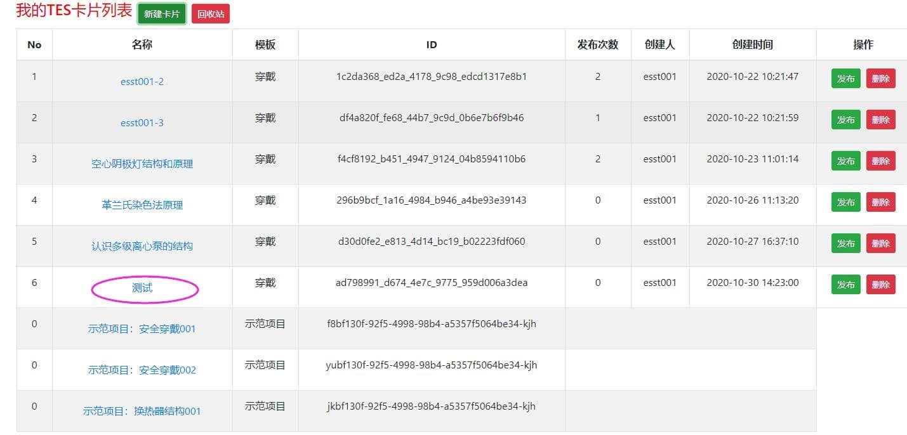

本章节，介绍拖拽类型任务卡的完整开发过程。

> 确定开发环境是否满足([开发要求 | TES 开发平台 (liuzhengcai.github.io)](https://liuzhengcai.github.io/teseditor/docs/DevelopmentRequirements))

## 进入开发平台

开发平台如下图：

##  添加任务卡

 输入任务卡名称，点击**`“保存”`** ；

等待弹出**`“保存TES List完毕”`**通知，点击**`“确定”`**，新的任务卡创建完毕；

## 进入编辑模式

找到已经创建好的任务卡，点击**`“任务卡名称（自己设定的）”`**，进入编辑界面；

编辑界面，可以听过添加、编辑等功能完成图元的操作，也可以通过积木的方式搭建逻辑代码。

- 布局说明：

| 功能区域划分 | 功能说明    |
|:-------------:|:----------------------------------------------------------|
| 开发预览窗口 | **`开发过程中`**实时预览，提供**`位置`**、**`大小`**、**`样式`**的展示；                         |
| 发布预览窗口 | **`开发完成后`**，手机扫码后的显示效果，支持**`发布前预览`**功能；                                |
| 资源预览窗口 | **`开发过程中`**，**`图元`**、**`背景`**等**`素材预览`**；                                        |
| 资源设置窗口 | **`开发过程中`**，**`图元`**、**`背景`**等，**`位置`**、**`大小`**、**`样式`** 等**`素材设定`**； |
| 代码开发窗口 | **`开发过程中`**，逻辑代码的**`积木搭接`**；                                                      |

 - 示意图：
 - 

## 添加、设置资源

> **`“保存”`**对于每一个环节都有着至关重要的作用，如果用户所有的操作在此期间没有进行保存的话，那么您徒劳而返。

### 位置与尺寸

在这个环节，我们所了解的是图元的**`“尺寸”`**和它的**`“位置”`**。

- 根据**`X`**、**`Y`**轴定义图元位置，而**`xsi`**、**`ysi`**则是定义图像大小。

- 且图元长宽必须为**`58`**。

  

### 添加背景

- 点击**`“背景”`**，在上传图片区域快选择你想要背景并上传。

> ps：在这个环节是需要保存操作的，否则背景不会被保存，且图片大小不能超过100kb。
>

>  图片是在此环节上传用于图元背景，选择好的背景会在图元上显示。

### 添加图元
- 操作步骤，依次添加**`“答案”`**、**`“重置”`**、**`提交`**；

  - 添加步骤：选中空白图元，点击**`“添加图元”`**，选中**`“Browse”`**，选择**`“本地素材”`**；

  - **`“答案”`**、**`“重置”`**尺寸为**`“50X50”`**；**`提交`**，尺寸为**`“146X36”`**；
  
    

### 添加列表

添加**`“列表”`**；

- 添加步骤：选中空白图元，点击**`“添加图元”`**，选中**`“Browse”`**，选择**`“本地素材”`**；

- **`“列表”`**尺寸为**`“336X92”`**；

- 必须选择类型为**`“列表”`**【不需要手动调整图元在列表中的位置，只要在列表图元中填充了**`“图元移动到***”`**代码】；

  

- 调整适当位置即可；

  

### 添加可放置图元

- 操作步骤，依次添加**`“可拖动的图元”`**，如**`“发射特征谱线”`**、**`两极间加压`**等；

  - 添加步骤：选中空白图元，点击**`“添加图元”`**，选中**`“Browse”`**，选择**`“本地素材”`**；
- **`“可放置图元尺寸”`**、**`“托盘”`**尺寸均为**`“58X58”`**；
  
  - 添加一个**`“可放置图元尺寸”`**，必须同样添加一个**`“托盘”`**，一一对应，除非**`“可放置图元尺寸”`**是干扰项；
  
    
  
  - 必须保证图元名称正确；
  
    
  
### 添加托盘

- **`“托盘”`**是用来盛放图元的工具，相当于图元的归宿，把可放置的图元拖动到相对应的托盘中进行互动。
  
  - 托盘的大小与样式必须与可放置图元一致。
  
    
  
  - 托盘名称必须正确；
  
     
  
### 添加答案

- 最好放完所有图元后放置，避免影响图元的摆放；

- 位置和大小建议与原始大小相匹配；

  

## 增加代码

完成资源添加后，最后再完成代码积木搭接，就可以查看效果与预览了。

### 增加重置代码

- 选择资源列表，点选重置图元

   

- 选择代码列表，点击图元，将其中的重置按钮，拖入代码预览窗口；

- 点击资源，选择保存卡片，完成重置代码积木的搭接；

### 增加列表代码

- 选择列表图元，点击代码，进入代码编辑界面

  

- 点击图元模块，选择图元积木移入列表，拖入开发预览窗口；

  

- 点击文本模块，选择自定义文本积木，拖入图元积木移入列表接口；

  

- 在文本模块，输入自定义命名的可放置图元名称，复制积木块，继续增加其他可放置图元；

  

### 增加提交代码

- 选择提交图元，点击代码，进入代码编辑界面
  
  

-  点击提交模块，选择逻辑积木，拖入开发预览窗口；

  

- 点击文本模块，选择自定义文本积木，拖入文本积木移入列表接口；

  

- 点击图元模块，选择图元积木，拖入开发预览窗口；

  

- 点击数字模块，选择自定义数字积木，拖入文本列表中；

  
  
### 增加答案代码

- 选择答案图元，点击代码，进入代码编辑界面
  
  

-  点击提交模块，选择逻辑积木，拖入开发预览窗口；

  

- 点击文本模块，选择自定义文本积木，拖入文本积木移入列表接口；

  

- 点击图元模块，选择图元积木，拖入开发预览窗口；

  

### 增加背景代码

- 选择背景图元，点击代码，进入代码编辑界面
  
  

- 点击提交模块，选择逻辑积木，拖入开发预览窗口；

  

  
- 点击文本模块，选择自定义文本积木，拖入“文本”积木移入列表接口；

  

- 点击图元模块，选择图元积木，拖入开发预览窗口；

  

## 预览与调整

**`“预览”`**就是欣赏劳动成果并对此进行点评及其修改，从而达到完善。

> 预览前，需要先保存！
>
> 

## 发布

- 调整完成后，需要再次点击保存，准备进行发布;

  

- 点击**`“我的Tes”`**;

  

- 找到**`“空心阴极灯结构和原理”`**，点击发布;

  

- 点击**`“发布运行”`**;

  

- 发布效果如下：

  - 发布至ESCC，请参阅[发布到ESCC](https://liuzhengcai.github.io/teseditor/docs/ReleaseToESCC)；
  - 其他，请耐心等待或联系zl；

  

  

  
