---

id: DevelopmentRequirements
title: 开发要求
---

## 环境要求

> 本平台目前版本为1.0，仅支持**`Chrome谷歌浏览器`**及**`Chrome谷歌浏览器`**。

- [Google Chrome下载](https://dl.google.com/tag/s/appguid%3D%7B8A69D345-D564-463C-AFF1-A69D9E530F96%7D%26iid%3D%7BBD00B6B7-1A56-4B59-4DD4-9E4C2F33CE0C%7D%26lang%3Dzh-CN%26browser%3D5%26usagestats%3D1%26appname%3DGoogle%2520Chrome%26needsadmin%3Dprefers%26ap%3Dx64-stable-statsdef_1%26installdataindex%3Dempty/update2/installers/ChromeSetup.exe)

- [Microsoft Edge下载](https://www.microsoft.com/zh-cn/edge)

### 如何查看Edge浏览器的版本号及内核?：
- 首先打开Edge浏览器。如图：

  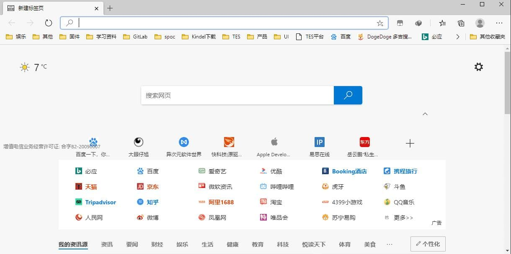

- 点击右上角“...”，弹出下拉菜单：

  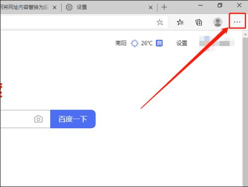

- 点击“帮助和反馈”选项，选择“关于Microsoft Edge”选项；

  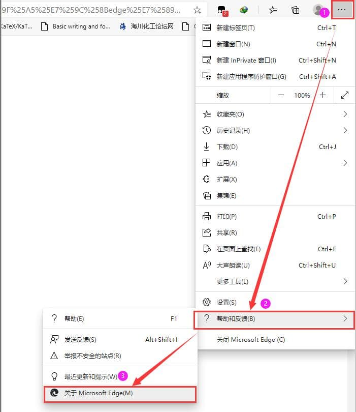

  

- 在右侧即可看到浏览器的版本及基于的内核。如图：

  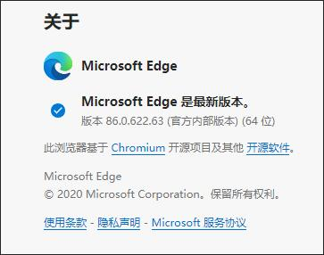

## UI素材规范

### 设计基准

####  设备基准，以iPhone7为准 

- **`750X1334`**像素，**`72像素/尺寸`** ；
- **px(pixel，像素)**：相对长度，设计基本上都是用px来标注；
- **pt(point，点)**：是一个物理长度单位，指的是72分之一英寸，iOS开发基本单位；

| 基准                                             | 设计像素   | 开发尺寸  | 切图尺寸  |
| ------------------------------------------------ | ---------- | --------- | --------- |
| iphone11Pro，XS，X，8，7，6s，6，4.7”iPhone se； | 750X1334px | 375x667pt | 375X667px |

​        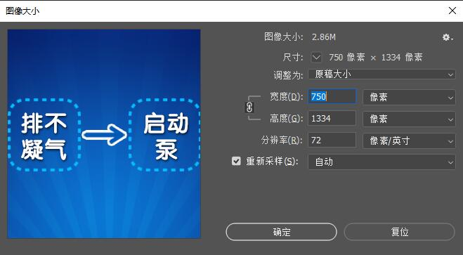

#### 应用于易思云课堂（ESCC）小程序：

- 导航栏128rpx【可以理解为128px】；

- ~~标签栏98rpx，ESCC中无标签栏；~~

- 有效设计尺寸**`750X1206px（1334-128）`**；

  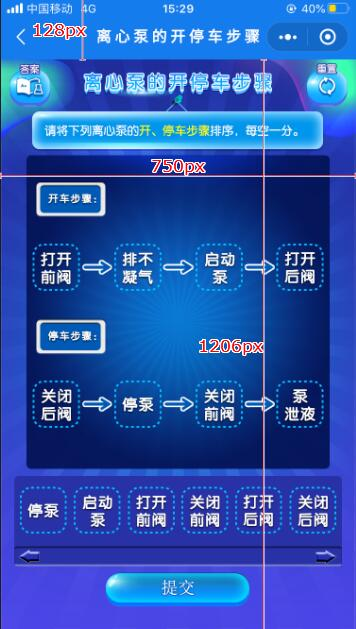

#### 资源整体大小控制在**`1mb`**以内；

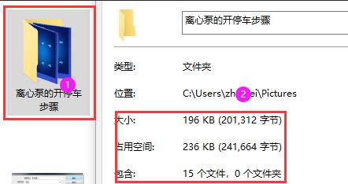

### 设计规范

#### 配色

- 谨慎使用颜色，颜色对信息的传递有直接的增强作用；
- 尽量使用互补色，而不是冲突的或者分散注意力的配色；
- 尽量保持整体色彩应用表达的统一；

#### 交互区域

- 最小保持**`44X44px`**的最小可交互尺寸；

- 交互区域避免设置在屏幕边角，可能会误触发手势操作。

  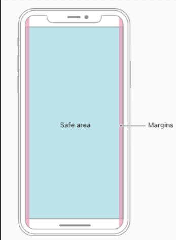

  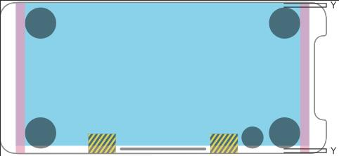

  

#### 图标与元素

- 尽量设置可识别、高度简化的设计；
- 尽量保持风格、样式一致；

#### 字体

- 避免使用不可商用字体；
- 保持美观的文字排版；
- 保持任务卡的整体一致性

### 切图规范

#### 规范

| 图元名称   | 命名与格式               | 尺寸(PX)  | 位数  | 大小(KB) |
| :--------: | :--------------------: | :-------: | :-----: | :-----: |
| 背景图元   | bg.jpg                   | 375X603 | 8或24 | ≤50 |
| 重置       | btn_r.png                | 44X46   | 8     | ≤2  |
| 答案       | btn_a.png                | 44X46   | 8     | ≤2  |
| 选择栏     | sbar.png                 | 374X96  | 8     | ≤1  |
| 提交       | btn_s.png                | 153X37 | 8     | ≤2  |
| 可放置图元 | d_*****.png【*可自定义】 | 50X50 | 8     | ≤2  |
| 托盘       | t.png                    | 50X50 | 8     | ≤2  |

#### 背景：

- **`375X603px`**；**`24位`**，**`.jpg`** 格式，大小不超过**`50kb`**；

- 不包含以下图元，如 **重置** 、**答案** 、**查看** 、**提交** 、 **交互的图元** 和 **可放置的图元** 、**托盘** 、**列表**等；

  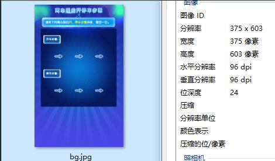

#### 答案、重置按钮

- 分辨率**`44X46`**，**`8位`**，**`.png`** 格式，单个文件大小不超过**`2kb`**；

  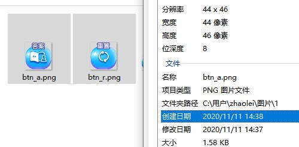

#### 可放置图元、 **托盘** ：

- 分辨率**`50X50`**，**`8位`**，**`.png`** 格式，单个文件大小不超过**`2kb`**；

  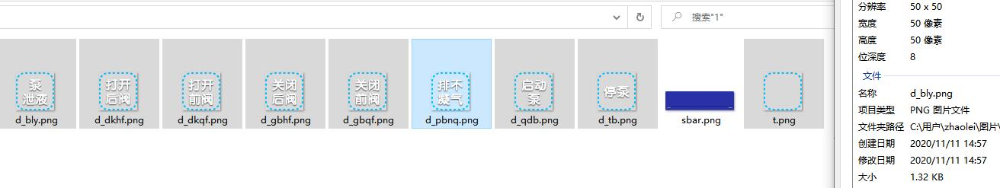

#### 列表【选择栏】 ：

- 分辨率**`347X96`**，**`8位`**，**`.png`** 格式，文件大小不超过**`1kb`**；

  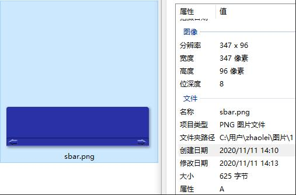

#### 提交按钮

- 分辨率**`153X37`**，**`8位`**，**`.png`** 格式，文件大小不超过**`2kb`**；

  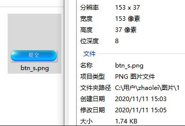

### 优化规范

- 关于素材压缩使用https://docsmall.com/image-compress；

- 将已经处理好的UI拖入此网站，进行压缩，打包下载；

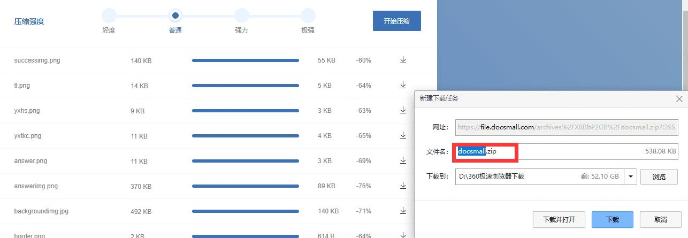

### 拖拽模板
#### 开发人员需要如下资源： 

- 固定模板UI，不用重复绘制，为拖拽模板固定UI组成。内容包括：数字UI,系统常用按钮，底图框图，选择框题、所有边框尺寸固定为100X100;
- 自定义UI，美工绘制好的卡片UI,内容包括：要进行拖拽的元素，整个界面底图，弹出答案图，整体卡片效果图等。

### 连线模板

#### 开发人员需要如下资源：

- 固定模板UI，不用重复绘制，为拖拽模板固定UI组成。内容包括：数字UI,系统常用按钮，提示框图，勋章底图等，所有边框，尺寸最大为160X160；
- 自定义UI，美工绘制好的卡片UI,内容包括：要进行连线左右按钮，整个界面底图，弹出答案图，整体卡片效果图等。连线模板分左右2列按钮命名编号从1开始，左侧起始为left1最多5个按钮，右侧按钮编号从左侧编号结束开始以right开头。每个按钮由选中和未选中2张UI组成，比如left1由left1和left11组成依次类推。如下图： 
