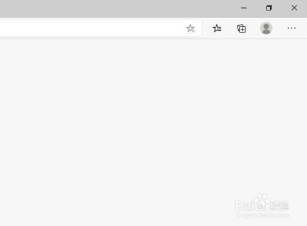
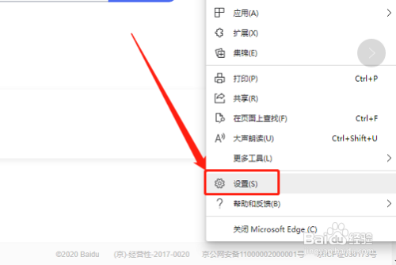
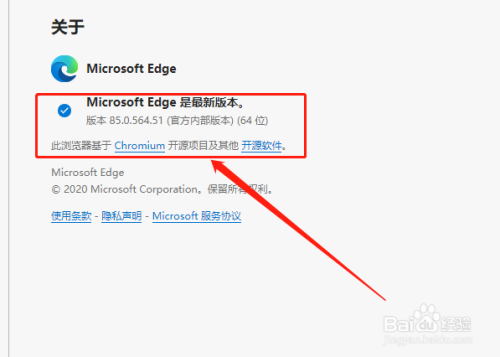
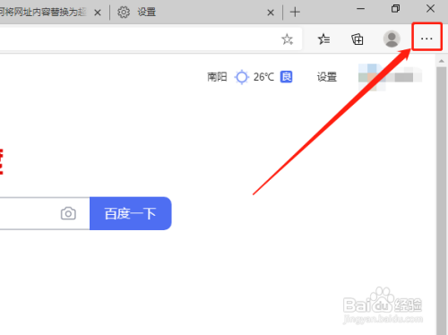
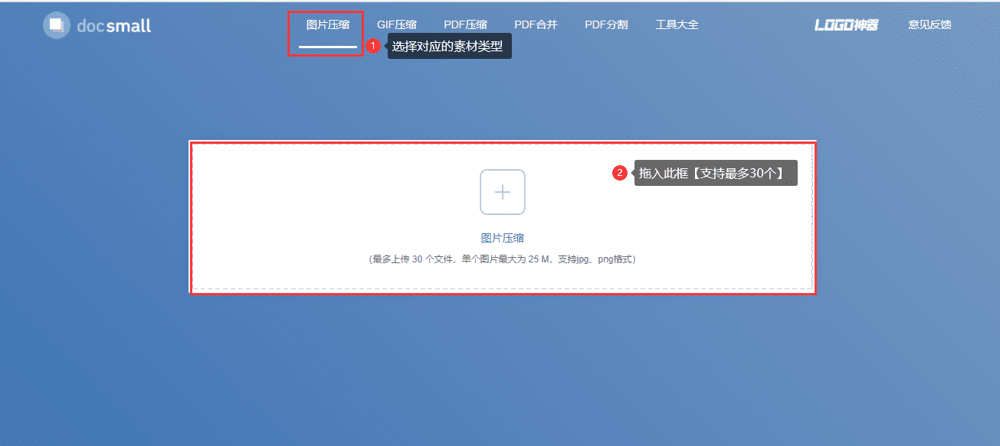
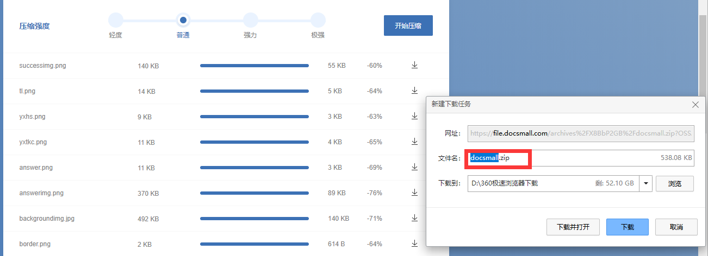

## 环境要求

> 本平台目前版本为1.0，仅支持Chrome谷歌浏览器及Chrome内核的Microsoft Edge。

- [Google Chrome下载](https://dl.google.com/tag/s/appguid%3D%7B8A69D345-D564-463C-AFF1-A69D9E530F96%7D%26iid%3D%7BBD00B6B7-1A56-4B59-4DD4-9E4C2F33CE0C%7D%26lang%3Dzh-CN%26browser%3D5%26usagestats%3D1%26appname%3DGoogle%2520Chrome%26needsadmin%3Dprefers%26ap%3Dx64-stable-statsdef_1%26installdataindex%3Dempty/update2/installers/ChromeSetup.exe)

- [Microsoft Edge下载](https://www.microsoft.com/zh-cn/edge)

### 如何查看Edge浏览器的版本号及内核?：
- 首先打开Edge浏览器。如图：

- 点击右上角“设置及其他”按钮。如图：

- 在下拉菜单中，点击“设置”选项。如图：

- 在左侧，点击“关于Microsoft Edge”选项。如图：

- 在右侧即可看到浏览器的版本及基于的内核。如图：

## UI素材规范

### 设计规范

#### 基准设计

> - ** 基准设计尺寸** 以 **`750X1334`**像素，**`72像素/尺寸`** ；
> - 整体大小控制在**`1mb`**以下；
> - 切图像素为 **`实际像素/2`** ，质量 **`100`**,默认使用 **`.jpg`** 格式，透明图使用 **`.png`** ；

| 设备名称 | 屏幕尺寸 | PPI | Asset | 竖屏点（point） | 竖屏分辨率（px） |
| :----: | :----: | :----: | :----: | :----: | :----: |
| iPhone 8, 7, 6s, 6  | 4.7 in | 326 | @2x | 375 x 667 | 750 x 1334 |

### 切图规范

#### 背景：

- **`750X1334`**像素、**`.jpg`** 格式；

- 不包含，如 **重置** 、**答案** 、**查看** 、**提交** 、 **交互的图元** 和 **可放置的图元** 、**托盘** 、**列表**等；

#### 可放置图元、 **托盘** ：

- 分辨率**`100X100`**，**`.png`** 格式；

#### 列表 ：

- 分辨率**`100X100`**，**`.png`** 格式；

### 命名规则

- 命名方式，参照模板,**`不能为中文`**，禁止**`空格等非法字符`**；

### 优化规范

- 关于素材压缩使用https://docsmall.com/image-compress；

 

- 将已经处理好的UI拖入此网站，进行压缩，打包下载；

 

## 设计效果建议

- 每套模板UI分别由，固定模板UI(系统不可变)+自定义UI（用户定义）,两部分组成;

### 拖拽模板
#### 以CO2压缩机单元开车步骤卡片为例，开发人员需要如下资源： 

- 固定模板UI，不用重复绘制，为拖拽模板固定UI组成。内容包括：数字UI,系统常用按钮，底图框图，选择框题、所有边框尺寸固定为100X100;
- 自定义UI，美工绘制好的卡片UI,内容包括：要进行拖拽的元素，整个界面底图，弹出答案图，整体卡片效果图等。

### 连线模板

#### 以泵的分类为例，开发人员需要如下资源：

- 固定模板UI，不用重复绘制，为拖拽模板固定UI组成。内容包括：数字UI,系统常用按钮，提示框图，勋章底图等，所有边框，尺寸最大为160X160；
- 自定义UI，美工绘制好的卡片UI,内容包括：要进行连线左右按钮，整个界面底图，弹出答案图，整体卡片效果图等。连线模板分左右2列按钮命名编号从1开始，左侧起始为left1最多5个按钮，右侧按钮编号从左侧编号结束开始以right开头。每个按钮由选中和未选中2张UI组成，比如left1由left1和left11组成依次类推。如下图： 
