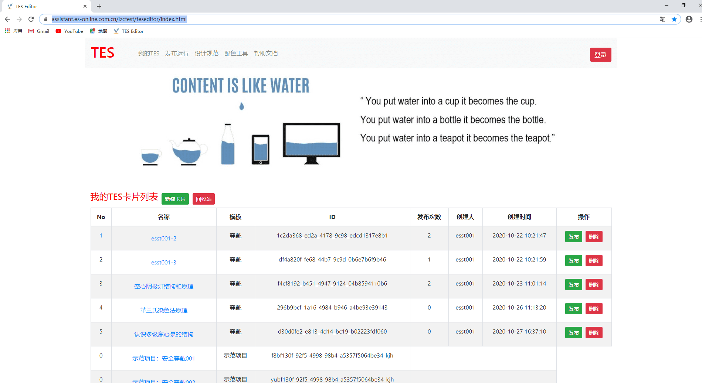
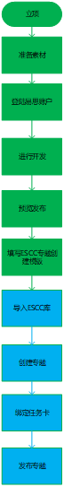

版本：1.0   更新日期：2020-10-27

**TES开发平台**是专为**`非编程人员`**设定的一款 **`简易图形化`**开发平台旨在倡导由**`工艺人员或实习生和美工`**独立开发完成TES任务卡片，提供**`交互式、趣味性`**的任务卡，并且能够提供**`丰富的模板`**，**`扩展教学资源`**：

- **图形界面** ：简易的图形化开发界面，学习与使用**`极易`**上手；
- **逻辑积木** ：逻辑开发完全使用积木搭接的方式，提供常见的**`逻辑积木`**模块，示例项目等；
- **实时预览** ：开发过程中，支持手机扫码**`实时预览`**。

-----------------------------------

## 平台地址

- 地址链接：https://assistant.es-online.com.cn/lzctest/teseditor/index.html

   - 开发平台如下图：

    

## 应用范围
>**提示: ** 当前列举应用范围并不完全，请以实际应用为准。

| 应用课程 | 场景描述                                                     |
| :------- | ------------------------------------------------------------ |
| 化工原理 | 配合《化工原理》，化工实验等基础原理课程，掌握原理认知、理论认知等 |
| 工艺流程 | 配合工艺流程视频、PPT等素材，扩展工艺流程类课程活动          |
| 设备结构 | 配合设备结构、PPT等素材，扩展结构类课程活动                  |
| 安全实训 | 配合安全实训类课程使用，如危险源识别、实验室安全等           |

## 使用流程

  

