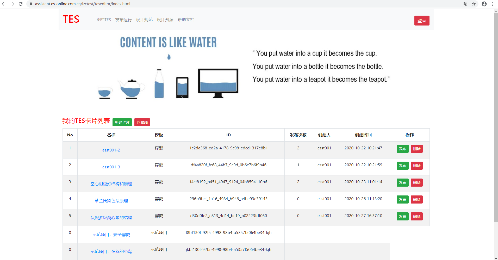
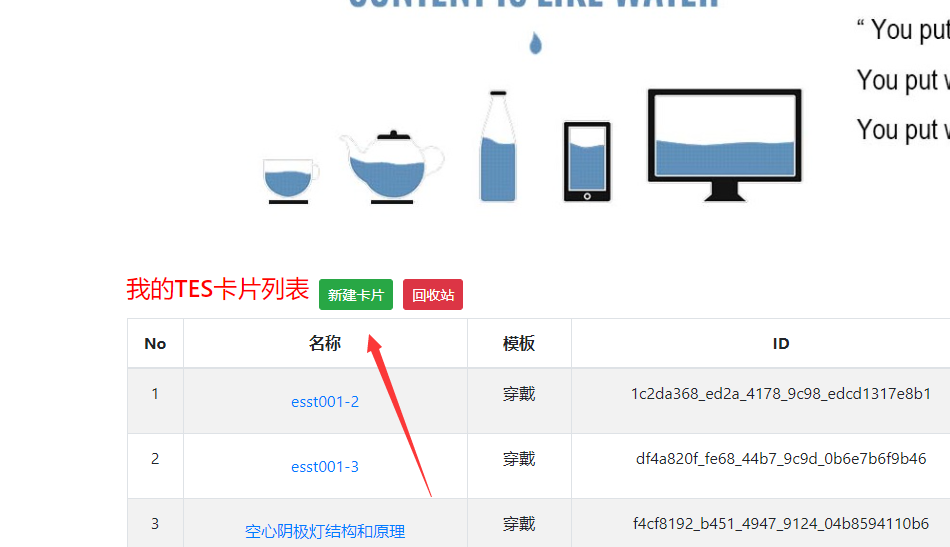
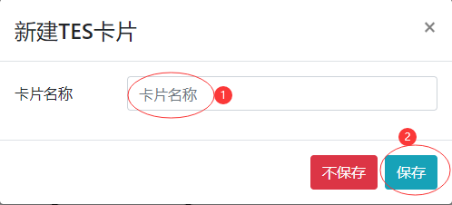
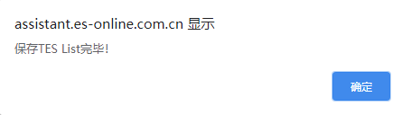
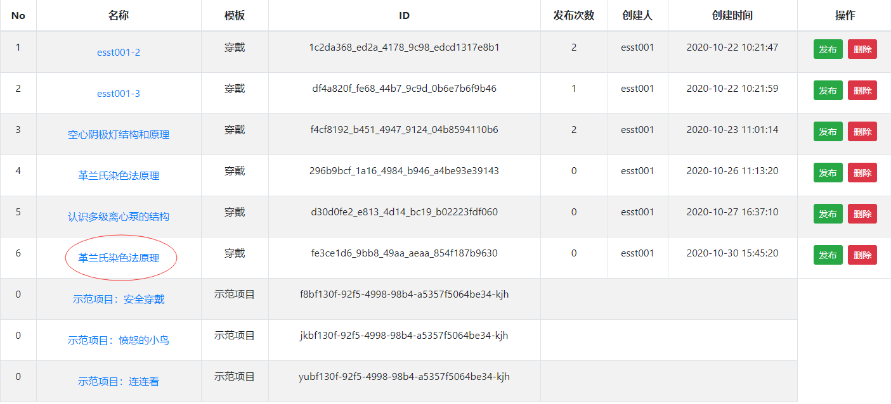
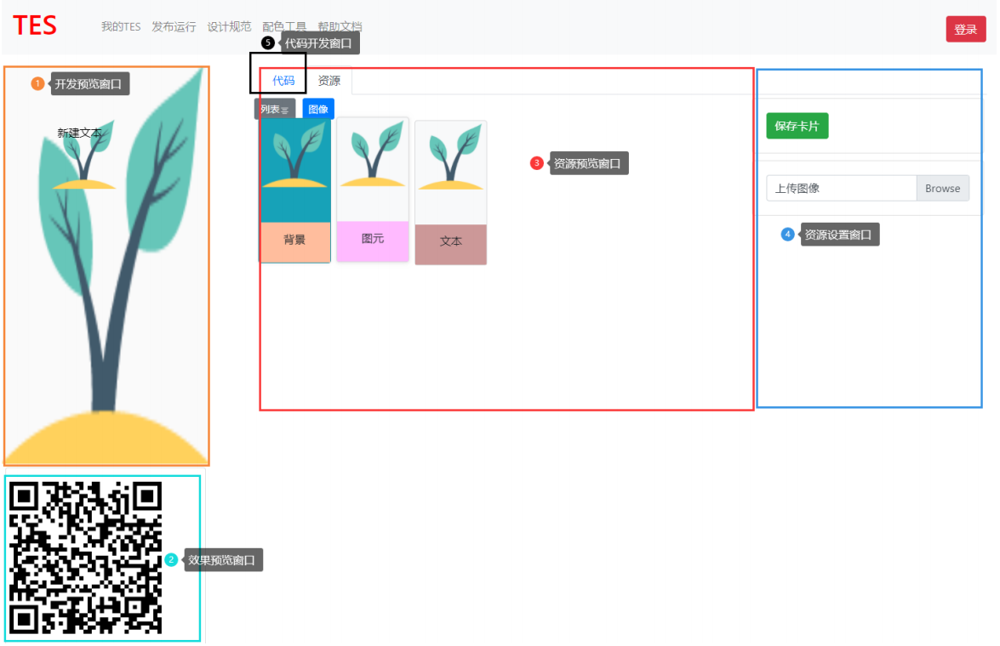
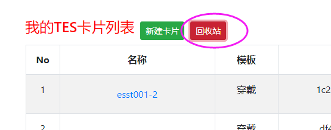
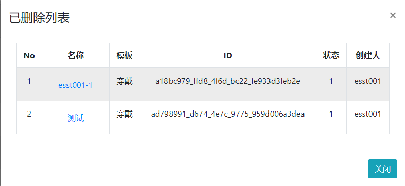

1. 找到并打开，TES开发平台地址：

   - 地址链接：https://assistant.es-online.com.cn/lzctest/teseditor/index.html

   - 开发平台如下图：

     

2. 在文档中部左上角的 **`“新建卡片”`** 

   

3. 输入任务卡名称，点击**`“保存”`** ；

   

4. 等待弹出**`“保存TES List完毕”`**通知，点击**`“确定”`**，新的任务卡创建完毕；

  

5. 找到已经创建好的任务卡，点击**`“任务卡名称（自己设定的）”`**，进入编辑界面；

   

6. 编辑界面，可以添加、编辑等功能完成图元的操作，也可以通过积木的方式搭建逻辑代码。

   - 布局说明：

| 功能区域划分 | 功能说明                                                                                          |
|--------------|---------------------------------------------------------------------------------------------------|
| 开发预览窗口 | **`开发过程中`**实时预览，提供**`位置`**、**`大小`**、**`样式`**的展示；                          |
| 发布预览窗口 | **`开发完成后`**，手机扫码后的显示效果，支持**`发布前预览`**功能；                                |
| 资源预览窗口 | **`开发过程中`**，**`图元`**、**`背景`**等**`素材预览`**；                                        |
| 资源设置窗口 | **`开发过程中`**，**`图元`**、**`背景`**等，**`位置`**、**`大小`**、**`样式`** 等**`素材设定`**； |
| 代码开发窗口 | **`开发过程中`**，逻辑代码的**`积木搭接`**；                                                      |

   - 示意图：

7. **`“回收站”`**：就是那些不如你意的归宿，并可在此查看那些失败品。

- 回收站内部说明：查看回收站里面的东西。

