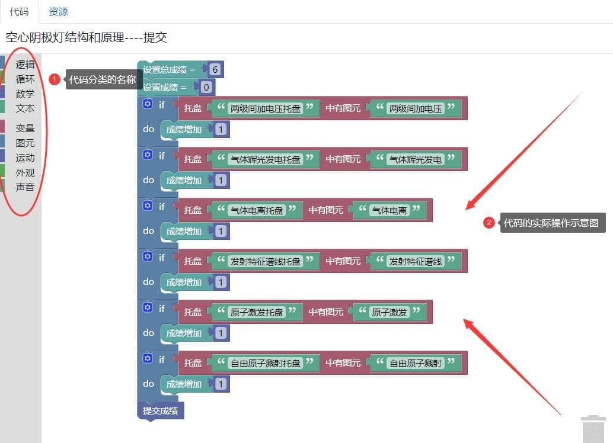
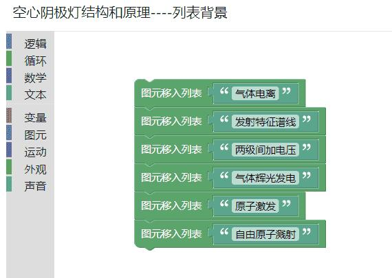
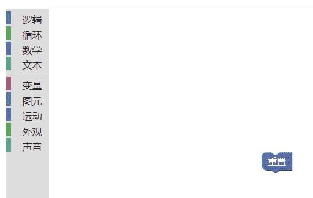
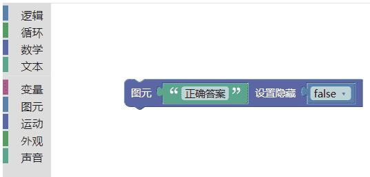
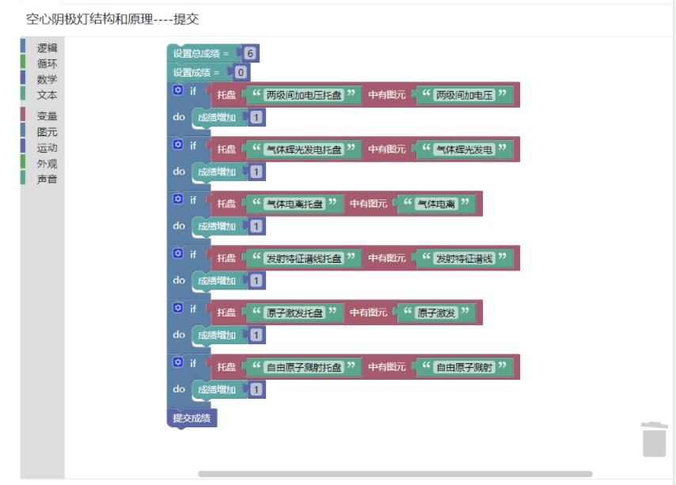

---

id: Code
title: 代码
---

**`“代码”`**这一环节，是用来定义卡片的逻辑功能，用户可以在此实现自己想要的功能赋予给卡片。

- 代码涉及到**逻辑**，**循环**，**数学**，**文本**，**变量**，**图元**，**运动**，**外观**，**声音**。

| 名称 | 含义                                                         |
| :--- | :----------------------------------------------------------- |
| 逻辑 | 是一个外来词语音译，指的是思维的规律和规则。                 |
| 循环 | 事物周而复始地运动或变化                                     |
| 数学 | 经常被缩写为math或maths]，是研究数量、结构、变化、空间以及信息等概念的一门学科。 |
| 文本 | 是指书面语言的表现形式                                       |
| 变量 | 来源于数学，是计算机语言中能储存计算结果或能表示值的抽象概念。 |
| 图元 | 全称为图形输出原语(graphics output primitive)，是图形软件包中用来描述各种图形元素的函数，或简称为图元(primitive)。 |
| 运动 | 是一种涉及体力和技巧的一套规则，又有习惯所约束的行为活动，通常具有竞争性。 |
| 外观 | 物体外表的样子。                                             |
| 声音 | 声音（sound)是由物体振动产生的声波。                         |

- **列表背景**：在此环节，首先要选择图元代码，根据图元的数量插入相同得代码，并在里面插入文本格式的代码，并输入相对的名称。

**`注意`**在这里的图元名称必须与文本形式。

- **重置**：重置按钮的代码属于图元，选择插入即可，功能为重置页面元素。

- **答案**：选择图元代码模块，并在此插入正确代码的文本，隐藏为false。

- **提交**：首先，要先设置总成绩，总成绩为答案总分。
  初始成绩为0，设置if do的循环，循环数量为答案个数，选择图元托盘插入图元文本名称以及该文本所对应的托盘，如若对应，成绩加1并提交成绩。

