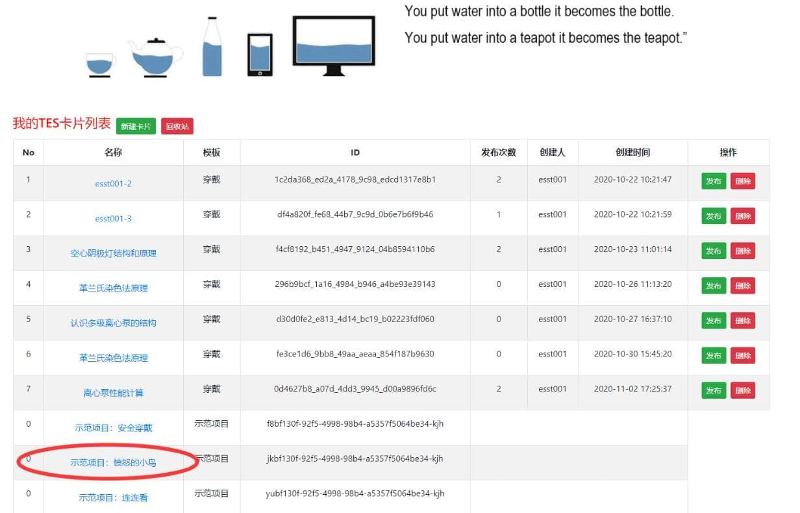
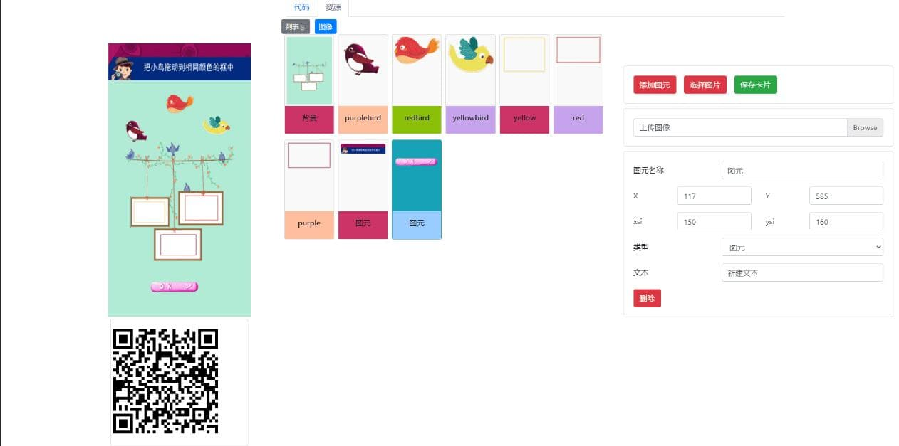
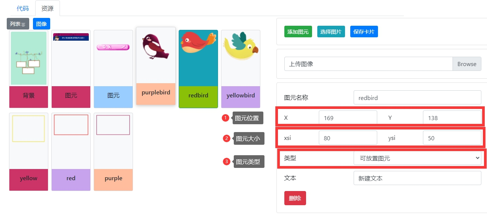
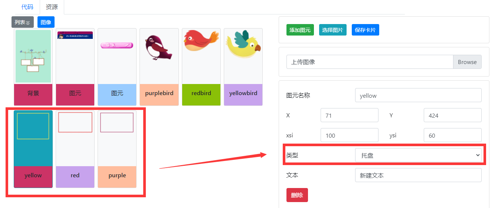
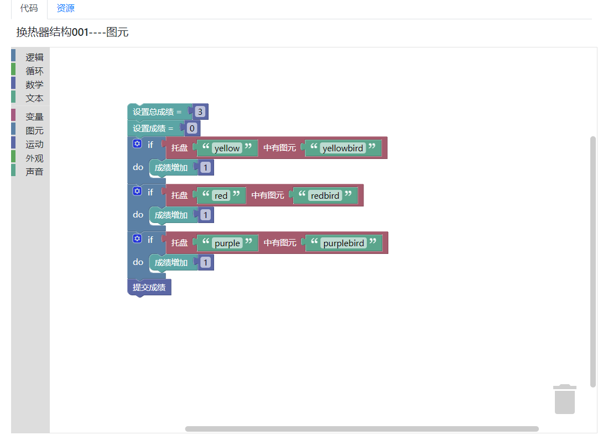

> 在本教程中，你将从头开始构建自己的应用，体验典型的开发过程。这里还有一些对基本的应用设计概念、工具和术语的介绍。

> 如果你对 **`“TES”`** 还不熟悉，你可能要先试一试 快速上手应用。它基于一个现成的、已部分完成的项目，你可以在交互式开发环境中检查和修改，你还可以在那里实时查看结果。

> “试一试”教程遵循最新的最佳实践，以简明的格式，涵盖了与其相同的主要话题 - 组件、模板语法、路由、服务。

在本教程的最后，你将完成下列工作：

- 了解开发平台的页面布局。

- 熟悉开发平台的基本操作。

- 能够自主使用平台开发。

**布局了解及其简述**

**首先**：我们来到会看到这样一个页面供大家做一个**`“初步了解”`**。

- 在此页面中，可以看到标记的示范项目，点击示范项目进入第二环节。

**其次**：我们进去该项目之后，会看到一个完整的实例项目，在这个页面中我们可以随意操作来达到对平台的初步认识。

- 在这一步的进行中，尽量去尝试页面中所拥有的所有元素来提升自己对平台的熟练度。

- **`“具体操作”`**为：点击->进入->拖动图元到托盘->修改操作->保存->预览->发布

**之后**：在此，更改其中的样式使其完善，添加多样元素来填充布局，完善自己的操作手段。

- 在这里，要注意 **`“图元位置”`**，**`“图元大小”`**，**`“图元类型”`**。

- **`“图元位置”`**：可以在页面预览页面拖动图元选择合适的位置属性来进行操作。

- **`“图元大小”`**：在预览页面调试图元长宽以至于到合适的大小。

- **`“图元类型”`**：给对应的图元定义对应的类型。

**最后**：在内部预览无恙的情况下，扫描二维码来拖动操作实现自己的成果。

**`“代码”`**：用来定义开发中一些功能性图元的效果。

- 在里面用户可以根据自己的需求来选择对应的代码图元拼接以致于达到效果。

**`“注意事项”`**：在这些环节中，代码环节尤为重要，因为他是实现图元能力实现效果的必要关键，所以请认真了解代码需要进入下方环节以便深入。